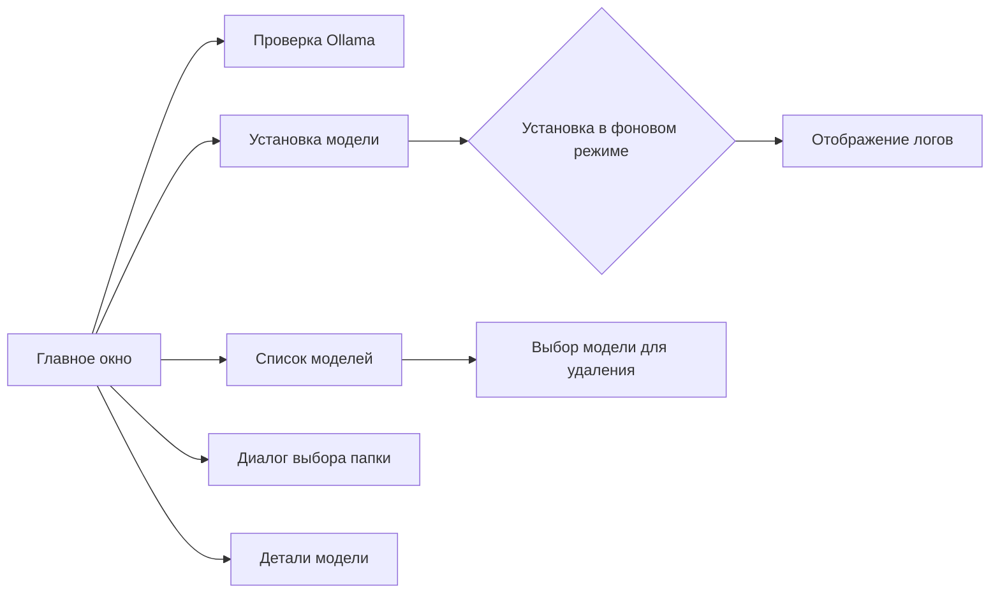

# 🤖 OllamaAgent - Продвинутый AI Чат-Клиент

**OllamaAgent** - это полнофункциональное десктопное приложение на Python с графическим интерфейсом для работы с локальными большими языковыми моделями через Ollama API. Приложение предоставляет мощные инструменты для общения с ИИ, детальную статистику производительности и автоматическую оптимизацию системы.

  

---

## ✨ Основные Возможности

### 💬 Интеллектуальный Чат
- **Потоковая генерация ответов** в реальном времени
- **Поддержка всех Ollama моделей** (Llama, Qwen, Mistral, и др.)
- **Система контекста** с сохранением истории разговоров
- **Синтаксическая подсветка** кода в ответах
- **Автоматическое форматирование** текста

### 📊 Расширенная Статистика
- **Время до первого токена (TTFT)** - ключевой показатель отзывчивости
- **Подсчет входных/выходных токенов** для каждого запроса
- **Общая статистика сессии** с накоплением данных
- **Скорость генерации** (токенов в секунду)
- **Мониторинг использования памяти** и ресурсов
- **Детальные метрики производительности**

### ⚙️ Автоматическая Оптимизация
- **Анализ аппаратного обеспечения** (CPU, GPU, RAM)
- **Автоматическая настройка параметров** Ollama
- **Оптимизация для конкретного оборудования**
- **Адаптивные настройки** в зависимости от модели
- **Мониторинг системных ресурсов**

### 🎛️ Гибкая Настройка
- **Детальные параметры генерации** (температура, top-k, top-p)
- **Настройки аппаратного ускорения** (GPU layers, threads)
- **Контекстное окно** и длина ответов
- **Системные промпты** для каждой модели
- **Горячие клавиши** и управление интерфейсом

## 🏗️ Архитектура Проекта

### Структура Проекта
```
OllamaAgent/
├── main.py                 # Точка входа приложения
├── chat_window.py          # Основное окно чата
├── ollama_api.py           # API клиент для Ollama
├── system_optimizer.py     # Система автоматической оптимизации
├── workers.py              # Фоновые потоки обработки
├── ui_settings.py          # Настройки пользовательского интерфейса
├── widgets/                # Переиспользуемые UI компоненты
│   ├── chat_history.py     # История чата
│   ├── message.py          # Компонент сообщения
│   └── model_settings.py   # Настройки модели
├── ollama_config.json      # Конфигурация приложения
├── requirements.txt        # Зависимости Python
└── setup.py               # Установка пакета
```

### Компоненты Системы

#### 🔧 Core Components
- **Main Window** (`main.py`) - точка входа и управление жизненным циклом
- **Chat Interface** (`chat_window.py`) - основной пользовательский интерфейс
- **API Client** (`ollama_api.py`) - взаимодействие с Ollama сервером
- **System Optimizer** (`system_optimizer.py`) - автоматическая оптимизация

#### 🎨 UI Components
- **Chat History** - отображение истории разговоров
- **Message Widget** - компонент для отображения сообщений
- **Model Settings** - панель настройки параметров модели
- **Statistics Panel** - отображение статистики производительности

#### 🔄 Background Workers
- **Message Thread** - обработка сообщений в фоне
- **Model Thread** - управление моделями
- **Update Timer** - периодическое обновление статуса

---

## 🛠️ Технологии

### Основные Технологии
- **Python 3.9+** - основной язык разработки
- **PyQt6** - кросс-платформенный GUI фреймворк
- **Ollama API** - локальный сервер ИИ моделей
- **Requests** - HTTP клиент для API вызовов
- **psutil** - мониторинг системных ресурсов

### Дополнительные Библиотеки
- **pytest** - тестирование приложения
- **logging** - система логирования
- **json** - работа с конфигурацией
- **urllib3** - HTTP соединения

---

## 📋 Системные Требования

### Минимальные Требования
- **ОС**: Windows 10+, macOS 10.15+, Linux (Ubuntu 18.04+)
- **Процессор**: x86_64 архитектура
- **Оперативная память**: 8 GB минимум, 16 GB рекомендуется
- **Диск**: 10 GB свободного места для моделей
- **Python**: 3.9 или выше

### Рекомендуемые Требования
- **Процессор**: Intel Core i5/i7 или AMD Ryzen 5/7
- **Оперативная память**: 32 GB для больших моделей
- **GPU**: NVIDIA с CUDA поддержкой (опционально)
- **SSD**: для быстрой загрузки моделей

---

## 🚀 Установка и Запуск

### 1. Предварительные Требования

#### Установка Ollama
```bash
# macOS
brew install ollama

# Linux
curl -fsSL https://ollama.ai/install.sh | sh

# Windows (через Chocolatey)
choco install ollama
```

#### Запуск Ollama Сервера
```bash
ollama serve
```

### 2. Установка OllamaAgent

#### Клонирование Репозитория
```bash
git clone <repository-url>
cd OllamaAgent
```

#### Создание Виртуального Окружения
```bash
python -m venv venv
source venv/bin/activate  # macOS/Linux
# или
venv\Scripts\activate     # Windows
```

#### Установка Зависимостей
```bash
pip install -r requirements.txt
```

#### Установка Пакета
```bash
pip install -e .
```

### 3. Первый Запуск

#### Базовый Запуск
```bash
python main.py
```

#### С Детальным Логированием
```bash
python -u main.py 2>&1 | tee ollama_agent.log
```

#### Запуск с Отладкой
```bash
python -c "
import logging
logging.basicConfig(level=logging.DEBUG)
import main
main.main()
"
```

---

## 🎯 Использование

### Базовое Использование

#### 1. Выбор Модели
- Запустите приложение
- В левой панели выберите доступную модель из списка
- Дождитесь загрузки модели

#### 2. Отправка Сообщения
- Введите текст в поле ввода внизу окна
- Нажмите Enter или кнопку "Отправить"
- Дождитесь генерации ответа

#### 3. Просмотр Статистики
- После каждого ответа отображается детальная статистика
- Нажмите кнопку "📊 Статистика" для общей статистики сессии

### Расширенные Возможности

#### Настройка Модели
1. Нажмите кнопку "⚙ Модель" в левой панели
2. Измените параметры генерации:
   - **Temperature** (0.1-2.0) - креативность ответов
   - **Top-K** (1-100) - разнообразие выбора токенов
   - **Top-P** (0.1-1.0) - вероятностный порог
   - **Max Tokens** - максимальная длина ответа
3. Сохраните настройки

#### Системная Оптимизация
1. Нажмите кнопку "🔧 Оптимизация"
2. Просмотрите текущие настройки системы
3. Примените рекомендуемые параметры
4. Перезапустите сервер при необходимости

#### Управление Моделями
```bash
# Загрузка модели
ollama pull llama2:7b

# Список установленных моделей
ollama list

# Удаление модели
ollama rm model-name
```

---

## 📊 Расширенная Статистика

### Метрики Производительности

#### Временные Показатели
- **TTFT (Time to First Token)** - время до получения первого токена
- **Total Time** - общее время генерации ответа
- **Tokens per Second** - скорость генерации

#### Потребление Ресурсов
- **Input Tokens** - количество токенов во входном сообщении
- **Output Tokens** - количество токенов в ответе
- **Memory Usage** - использование оперативной памяти
- **CPU Threads** - задействованные потоки процессора

#### Статистика Сессии
- **Total Generations** - общее количество запросов
- **Total Input/Output Tokens** - суммарное потребление токенов
- **Average Response Time** - среднее время ответа
- **Session Duration** - продолжительность сессии

### Мониторинг в Реальном Времени
- **Live Statistics** - обновление показателей в реальном времени
- **Performance Graphs** - графическое отображение метрик
- **Resource Monitoring** - мониторинг системных ресурсов
- **Bottleneck Detection** - выявление узких мест

---

## ⚙️ Конфигурация

### Основная Конфигурация

#### Серверные Настройки
```json
{
  "server": {
    "OLLAMA_NUM_PARALLEL": "2",
    "OLLAMA_MAX_LOADED_MODELS": "2",
    "OLLAMA_CPU_THREADS": "12",
    "OLLAMA_LOW_VRAM": "true",
    "OLLAMA_KEEP_ALIVE": "30m"
  }
}
```

#### Параметры Генерации
```json
{
  "model": {
    "temperature": 0.1,
    "top_k": 20,
    "top_p": 0.7,
    "repeat_penalty": 1.2,
    "num_predict": 256,
    "num_ctx": 512
  }
}
```

### Расширенная Настройка

#### Аппаратное Ускорение
```json
{
  "runtime": {
    "num_thread": 12,
    "num_ctx": 4096,
    "num_gpu": 1,
    "gpu_layers": 35,
    "low_vram": false
  }
}
```

#### Системные Промпты
```json
{
  "system_prompts": {
    "coding": "You are an expert software developer...",
    "writing": "You are a professional writer...",
    "analysis": "You are a data analyst..."
  }
}
```

---

## 🔧 Разработка

### Структура Кода

#### Основные Классы
- `ChatWindow` - главное окно приложения
- `OllamaAPI` - клиент для работы с Ollama
- `SystemOptimizer` - оптимизатор системы
- `MessageThread` - обработчик сообщений
- `ChatHistory` - история разговоров

#### Паттерны Проектирования
- **MVC** - разделение логики и представления
- **Observer** - система событий и сигналов
- **Singleton** - управление ресурсами
- **Factory** - создание компонентов

### Тестирование

#### Запуск Тестов
```bash
# Все тесты
pytest tests/

# Тест конкретного модуля
pytest test_optimization.py

# Тест с покрытием
pytest --cov=ollama_agent tests/
```

#### Типы Тестов
- **Unit Tests** - тестирование отдельных функций
- **Integration Tests** - тестирование взаимодействия компонентов
- **UI Tests** - тестирование пользовательского интерфейса
- **Performance Tests** - тестирование производительности

### Отладка

#### Логирование
```python
import logging

# Включение детального логирования
logging.basicConfig(level=logging.DEBUG)

# Логирование в файл
logging.basicConfig(filename='ollama_agent.log', level=logging.INFO)
```

#### Профилирование
```python
import cProfile

# Профилирование основного цикла
cProfile.run('main.main()')

# Профилирование конкретной функции
cProfile.runctx('chat_window.ChatWindow()', globals(), locals())
```

---

## 🐛 Устранение Неисправностей

### Распространенные Проблемы

#### 1. Приложение не запускается
```bash
# Проверьте зависимости
pip list | grep PyQt6

# Переустановите зависимости
pip install --upgrade -r requirements.txt

# Проверьте Python версию
python --version
```

#### 2. Модели не загружаются
```bash
# Проверьте статус Ollama
ollama list

# Перезапустите сервер
ollama serve

# Проверьте доступность API
curl http://localhost:11434/api/version
```

#### 3. Медленная генерация
```bash
# Увеличьте количество потоков
export OLLAMA_CPU_THREADS=16

# Включите GPU ускорение
export OLLAMA_GPU_LAYERS=35

# Уменьшите контекст
export OLLAMA_CONTEXT_SIZE=2048
```

#### 4. Высокое потребление памяти
```bash
# Включите low VRAM режим
export OLLAMA_LOW_VRAM=true

# Уменьшите параллельные загрузки
export OLLAMA_MAX_LOADED_MODELS=1

# Ограничьте размер моделей
export OLLAMA_MAX_MODEL_SIZE=4GB
```

### Логи и Диагностика

#### Просмотр Логов
```bash
# Логи приложения
tail -f ollama_agent.log

# Логи Ollama
tail -f ~/.ollama/logs/

# Системные логи
dmesg | tail -20
```

#### Диагностические Команды
```bash
# Проверка системных ресурсов
python -c "import psutil; print(f'CPU: {psutil.cpu_count()} cores, RAM: {psutil.virtual_memory().total/1024/1024/1024:.1f} GB')"

# Проверка GPU
nvidia-smi

# Проверка сетевых соединений
netstat -tlnp | grep 11434
```

---

## 🤝 Вклад в Развитие

### Создание Pull Request
1. Fork репозиторий
2. Создайте feature branch
3. Внесите изменения
4. Добавьте тесты
5. Отправьте Pull Request

### Стиль Кода
- **PEP 8** - стандарты оформления Python кода
- **Type Hints** - аннотации типов
- **Docstrings** - документация функций
- **Meaningful Names** - понятные имена переменных

### Структура Коммитов
```
feat: добавление новой функциональности
fix: исправление ошибки
docs: обновление документации
style: исправление стиля кода
refactor: рефакторинг кода
test: добавление тестов
```

---

## 📄 Лицензия

Этот проект распространяется под лицензией MIT. См. файл `LICENSE` для подробностей.

## 🙏 Благодарности

- **Ollama Team** - за создание отличного локального AI API
- **PyQt6 Community** - за мощный GUI фреймворк
- **Open Source Community** - за вдохновение и поддержку

## 📞 Поддержка

### Сообщество
- **GitHub Issues** - для баг-репортов и feature requests
- **Discussions** - для вопросов и обсуждений
- **Wiki** - для документации и руководств

### Контакты
- **Email**: support@ollamaagent.com
- **Discord**: [OllamaAgent Community](https://discord.gg/ollama)
- **Telegram**: [@OllamaAgent](https://t.me/OllamaAgent)

---

**OllamaAgent** - ваш надежный партнер для работы с локальными ИИ моделями! 🚀

### Способ 1: Auto PY to EXE (Рекомендуется)
1. Установите Auto PY to EXE:
```bash
pip install auto-py-to-exe
```

2. Запустите Auto PY to EXE:
```bash
auto-py-to-exe
```

3. В открывшемся окне:
   - Выберите файл `main.py`
   - Отметьте "One File" (--onefile)
   - Отметьте "Window Based" (--windowed)
   - В поле "Output Directory" выберите папку для сохранения exe
   - Нажмите "Convert .py to .exe"

### Способ 2: PyInstaller (Через командную строку)
1. Установите PyInstaller:
```bash
python -m pip install pyinstaller
```

2. Создайте exe-файл:
```bash
python -m PyInstaller --onefile --windowed --name OllamaAgent main.py
```

### Результат
- Готовый exe-файл будет находиться в выбранной папке (для Auto PY to EXE) или в папке `dist` (для PyInstaller)
- Запускайте `OllamaAgent.exe`

### Важные замечания
1. Перед запуском exe-файла:
   - Установите Ollama с [официального сайта](https://ollama.com/download)
   - Добавьте путь к ollama.exe в PATH
   - Перезагрузите компьютер

2. Решение проблем:
   - Если exe не запускается, попробуйте запустить из командной строки для просмотра ошибок
   - Проверьте, не блокирует ли антивирус
   - Убедитесь, что все зависимости установлены

---

## Функциональность
### Основные возможности:
1. **Установка моделей**:
   - Рекомендованные модели: `phi3:3.8b`, `codegemma:2b`, `qwen2.5-coder:3b`.
   - Возможность ввести произвольное имя модели.
   - Отображение прогресса и логов установки.

2. **Управление моделями**:
   - Просмотр списка установленных моделей.
   - Удаление модели с подтверждением.
   - Просмотр деталей модели (размер, путь).

3. **Настройки папки**:
   - Выбор пользовательской директории для хранения моделей.
   - Сохранение пути между сессиями через конфигурационный файл.

---

## Технические требования
| Компонент         | Требования                                                                 |
|-------------------|---------------------------------------------------------------------------|
| **Язык**          | Python 3.8+                                                              |
| **Графический фреймворк** | PyQt6 (для интерфейса)                                           |
| **Дополнительные библиотеки** | `subprocess`, `json`, `os`                                   |
| **Ollama**        | Версия 0.6.2+ (команда `ollama --version` должна работать)              |

---

## Установка
### Шаги:
1. **Установите зависимости**:
   ```bash
   pip install pyqt6
   ```

2. **Скачайте/скопируйте код**:
   Сохраните основной файл `main.py` и запустите его:
   ```bash
   python main.py
   ```

3. **Убедитесь, что Ollama установлен**:
   ```bash
   ollama --version
   ```

---

## Использование
### Основные элементы интерфейса:
1. **Кнопка "Проверить Ollama"**:
   - Проверяет наличие Ollama и его версию.

2. **Рекомендованные модели**:
   - Выпадающий список с оптимальными моделями для анализа кода.
   - Возможность ввести имя произвольной модели вручную.

3. **Выбор папки**:
   - Диалоговое окно для выбора директории установки моделей.

4. **Список установленных моделей**:
   - Выпадающий список с именами и размерами моделей.
   - Поддержка удаления выбранной модели.

5. **Логирование**:
   - Вывод всех действий в нижней части окна (время, успешные действия, ошибки).

---

## Папка установки моделей
### Настройка:
- **По умолчанию**: `~/.ollama/` (стандартный путь Ollama).
- **Пользовательская папка**: выбирается через диалоговое окно и сохраняется в файл `~/.ollama_agent_config.json`.

### Примеры:
```bash
# Путь по умолчанию:
~/.ollama/models/phi3:3.8b

# Пользовательская папка:
/пользовательская/директория/models/codegemma:2b
```

---

## Управление моделями
### Установка модели:
1. Выберите модель из списка или введите её имя вручную.
2. Нажмите "Установить модель".
3. Логи будут показывать процесс скачивания и установки.

### Удаление модели:
1. Выберите модель из выпадающего списка.
2. Нажмите "Удалить модель".
3. Подтвердите действие в диалоговом окне.

### Просмотр деталей:
1. Выберите модель в списке.
2. Нажмите "Детали выбранной модели".
3. Откроется окно с:
   - Именем модели.
   - Размером файла.
   - Полным путём к модели.

---

## Диалоговые окна
### Выбор папки:
- Позволяет выбрать директорию для установки моделей.
- Появляется предупреждение о смене пути Ollama.

### Подтверждение удаления:
- Спрашивает подтверждение перед удалением модели.

### Детали модели:
- Отображает технические характеристики модели.

---

## Логирование
- Все действия выводятся в нижней части окна с временем:
  ```
  [10:00:00] Начинаю установку модели phi3:3.8b...
  [10:00:15] Модель установлена в /custom/path/models/phi3:3.8b!
  ```

- Ошибки отображаются с описанием:
  ```
  [10:05:00] Ошибка: Нет прав на запись в выбранную папку
  ```

---

## Возможные ошибки и решения
### 1. **Ollama не установлен**
- **Ошибка**: `Ollama не установлен. Сначала установите Ollama через терминал`
- **Решение**: Установите Ollama через:
  ```bash
  curl -fsSL https://ollama.ai/install.sh | sudo bash
  ```

### 2. **Неверный путь к модели**
- **Ошибка**: Модель не найдена в выбранной папке.
- **Решение**: 
  1. Проверьте файл конфигурации `~/.ollama_agent_config.json`.
  2. Нажмите "Обновить список моделей" для синхронизации.

### 3. **Проблемы с правами доступа**
- **Ошибка**: `Нет прав на запись в выбранную папку`.
- **Решение**: Выберите другую папку или дайте права через:
  ```bash
  sudo chmod -R 755 /путь/к/папке
  ```

---

## Примеры использования
### Установка модели:
```bash
# Запустите приложение:
python main.py

# В интерфейсе:
1. Выберите "phi3:3.8b" из списка.
2. Нажмите "Установить модель".
3. Логи покажут прогресс:
   [10:00:00] Скачивание файла...
   [10:00:15] Модель установлена в ~/.ollama/models/phi3:3.8b!
```

### Просмотр деталей:
```bash
# После установки:
1. Нажмите "Обновить список моделей".
2. Выберите модель в списке.
3. Нажмите "Детали выбранной модели":
   Имя модели: phi3:3.8b
   Размер: 2.1GB
   Полный путь: ~/.ollama/models/phi3:3.8b
```

---

## Возможности
### Асинхронность:
- Установка моделей выполняется в фоновом потоке (не блокирует интерфейс).

### Сохранение настроек:
- Путь к папке сохраняется в `~/.ollama_agent_config.json`.

### Безопасность:
- Все действия требуют подтверждения (например, удаление модели).
- Проверка прав доступа перед установкой.

---

### Скриншот интерфейса


---

### Дополнительные советы
- **Оптимизация**:
  - Используйте `phi3:3.8b` для анализа Java/Kotlin кода.
  - Для быстрой генерации Python-кода выберите `codegemma:2b`.

- **Безопасность**:
  - Не сохраняйте чувствительные данные в пользовательских папках.
  - Регулярно очищайте ненужные модели для экономии места.

---

### Спасибо за использование OllamaAgent!
Программа упрощает работу с Ollama, предоставляя интуитивный интерфейс и контроль над моделями ИИ.