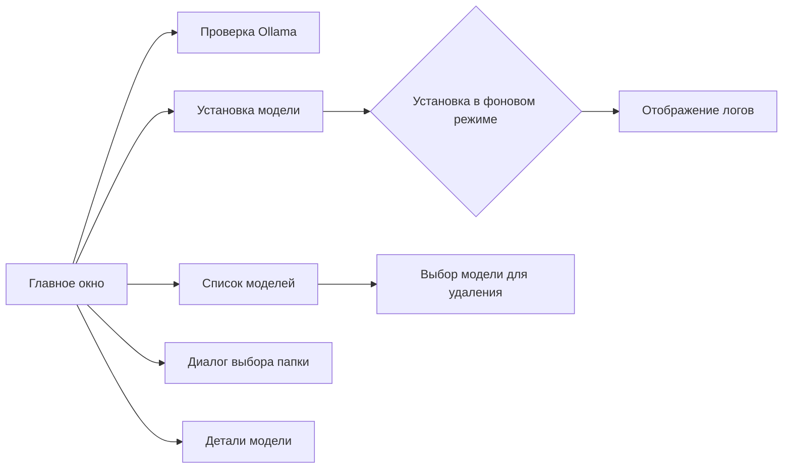

# OllamaAgent: Графический интерфейс для управления моделями Ollama

---

## Описание программы
OllamaAgent — это приложение на Python с графическим интерфейсом (GUI), которое упрощает управление локальными моделями ИИ через Ollama. Оно позволяет:
- Устанавливать, удалять и просматривать модели без использования терминала.
- Выбирать пользовательскую папку для хранения моделей.
- Просматривать детали модели (размер, путь к файлам).
- Работать с рекомендованными моделями для анализа кода и генерации документации.

---

## Создание exe-файла

### Способ 1: Auto PY to EXE (Рекомендуется)
1. Установите Auto PY to EXE:
```bash
pip install auto-py-to-exe
```

2. Запустите Auto PY to EXE:
```bash
auto-py-to-exe
```

3. В открывшемся окне:
   - Выберите файл `main.py`
   - Отметьте "One File" (--onefile)
   - Отметьте "Window Based" (--windowed)
   - В поле "Output Directory" выберите папку для сохранения exe
   - Нажмите "Convert .py to .exe"

### Способ 2: PyInstaller (Через командную строку)
1. Установите PyInstaller:
```bash
python -m pip install pyinstaller
```

2. Создайте exe-файл:
```bash
python -m PyInstaller --onefile --windowed --name OllamaAgent main.py
```

### Результат
- Готовый exe-файл будет находиться в выбранной папке (для Auto PY to EXE) или в папке `dist` (для PyInstaller)
- Запускайте `OllamaAgent.exe`

### Важные замечания
1. Перед запуском exe-файла:
   - Установите Ollama с [официального сайта](https://ollama.com/download)
   - Добавьте путь к ollama.exe в PATH
   - Перезагрузите компьютер

2. Решение проблем:
   - Если exe не запускается, попробуйте запустить из командной строки для просмотра ошибок
   - Проверьте, не блокирует ли антивирус
   - Убедитесь, что все зависимости установлены

---

## Функциональность
### Основные возможности:
1. **Установка моделей**:
   - Рекомендованные модели: `phi3:3.8b`, `codegemma:2b`, `qwen2.5-coder:3b`.
   - Возможность ввести произвольное имя модели.
   - Отображение прогресса и логов установки.

2. **Управление моделями**:
   - Просмотр списка установленных моделей.
   - Удаление модели с подтверждением.
   - Просмотр деталей модели (размер, путь).

3. **Настройки папки**:
   - Выбор пользовательской директории для хранения моделей.
   - Сохранение пути между сессиями через конфигурационный файл.

---

## Технические требования
| Компонент         | Требования                                                                 |
|-------------------|---------------------------------------------------------------------------|
| **Язык**          | Python 3.8+                                                              |
| **Графический фреймворк** | PyQt6 (для интерфейса)                                           |
| **Дополнительные библиотеки** | `subprocess`, `json`, `os`                                   |
| **Ollama**        | Версия 0.6.2+ (команда `ollama --version` должна работать)              |

---

## Установка
### Шаги:
1. **Установите зависимости**:
   ```bash
   pip install pyqt6
   ```

2. **Скачайте/скопируйте код**:
   Сохраните основной файл `main.py` и запустите его:
   ```bash
   python main.py
   ```

3. **Убедитесь, что Ollama установлен**:
   ```bash
   ollama --version
   ```

---

## Использование
### Основные элементы интерфейса:
1. **Кнопка "Проверить Ollama"**:
   - Проверяет наличие Ollama и его версию.

2. **Рекомендованные модели**:
   - Выпадающий список с оптимальными моделями для анализа кода.
   - Возможность ввести имя произвольной модели вручную.

3. **Выбор папки**:
   - Диалоговое окно для выбора директории установки моделей.

4. **Список установленных моделей**:
   - Выпадающий список с именами и размерами моделей.
   - Поддержка удаления выбранной модели.

5. **Логирование**:
   - Вывод всех действий в нижней части окна (время, успешные действия, ошибки).

---

## Папка установки моделей
### Настройка:
- **По умолчанию**: `~/.ollama/` (стандартный путь Ollama).
- **Пользовательская папка**: выбирается через диалоговое окно и сохраняется в файл `~/.ollama_agent_config.json`.

### Примеры:
```bash
# Путь по умолчанию:
~/.ollama/models/phi3:3.8b

# Пользовательская папка:
/пользовательская/директория/models/codegemma:2b
```

---

## Управление моделями
### Установка модели:
1. Выберите модель из списка или введите её имя вручную.
2. Нажмите "Установить модель".
3. Логи будут показывать процесс скачивания и установки.

### Удаление модели:
1. Выберите модель из выпадающего списка.
2. Нажмите "Удалить модель".
3. Подтвердите действие в диалоговом окне.

### Просмотр деталей:
1. Выберите модель в списке.
2. Нажмите "Детали выбранной модели".
3. Откроется окно с:
   - Именем модели.
   - Размером файла.
   - Полным путём к модели.

---

## Диалоговые окна
### Выбор папки:
- Позволяет выбрать директорию для установки моделей.
- Появляется предупреждение о смене пути Ollama.

### Подтверждение удаления:
- Спрашивает подтверждение перед удалением модели.

### Детали модели:
- Отображает технические характеристики модели.

---

## Логирование
- Все действия выводятся в нижней части окна с временем:
  ```
  [10:00:00] Начинаю установку модели phi3:3.8b...
  [10:00:15] Модель установлена в /custom/path/models/phi3:3.8b!
  ```

- Ошибки отображаются с описанием:
  ```
  [10:05:00] Ошибка: Нет прав на запись в выбранную папку
  ```

---

## Возможные ошибки и решения
### 1. **Ollama не установлен**
- **Ошибка**: `Ollama не установлен. Сначала установите Ollama через терминал`
- **Решение**: Установите Ollama через:
  ```bash
  curl -fsSL https://ollama.ai/install.sh | sudo bash
  ```

### 2. **Неверный путь к модели**
- **Ошибка**: Модель не найдена в выбранной папке.
- **Решение**: 
  1. Проверьте файл конфигурации `~/.ollama_agent_config.json`.
  2. Нажмите "Обновить список моделей" для синхронизации.

### 3. **Проблемы с правами доступа**
- **Ошибка**: `Нет прав на запись в выбранную папку`.
- **Решение**: Выберите другую папку или дайте права через:
  ```bash
  sudo chmod -R 755 /путь/к/папке
  ```

---

## Примеры использования
### Установка модели:
```bash
# Запустите приложение:
python main.py

# В интерфейсе:
1. Выберите "phi3:3.8b" из списка.
2. Нажмите "Установить модель".
3. Логи покажут прогресс:
   [10:00:00] Скачивание файла...
   [10:00:15] Модель установлена в ~/.ollama/models/phi3:3.8b!
```

### Просмотр деталей:
```bash
# После установки:
1. Нажмите "Обновить список моделей".
2. Выберите модель в списке.
3. Нажмите "Детали выбранной модели":
   Имя модели: phi3:3.8b
   Размер: 2.1GB
   Полный путь: ~/.ollama/models/phi3:3.8b
```

---

## Возможности
### Асинхронность:
- Установка моделей выполняется в фоновом потоке (не блокирует интерфейс).

### Сохранение настроек:
- Путь к папке сохраняется в `~/.ollama_agent_config.json`.

### Безопасность:
- Все действия требуют подтверждения (например, удаление модели).
- Проверка прав доступа перед установкой.

---

### Скриншот интерфейса


---

### Дополнительные советы
- **Оптимизация**:
  - Используйте `phi3:3.8b` для анализа Java/Kotlin кода.
  - Для быстрой генерации Python-кода выберите `codegemma:2b`.

- **Безопасность**:
  - Не сохраняйте чувствительные данные в пользовательских папках.
  - Регулярно очищайте ненужные модели для экономии места.

---

### Спасибо за использование OllamaAgent!
Программа упрощает работу с Ollama, предоставляя интуитивный интерфейс и контроль над моделями ИИ.